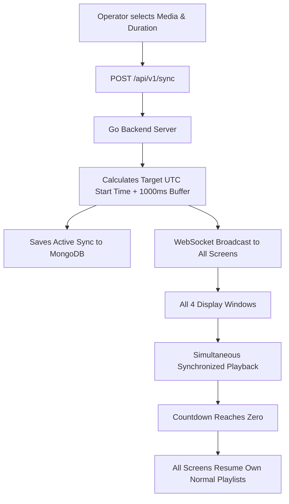
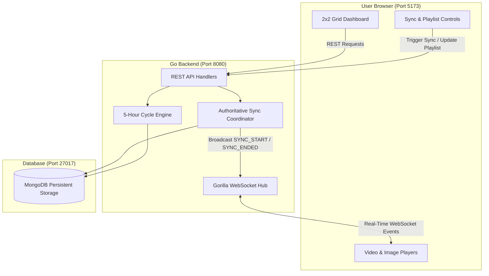

# Multi-Window Media Sequencer

A full-stack digital signage system that plays independent looping video and image playlists across multiple display windows over a fixed 5-hour cycle, with instant server-synchronized playback overrides.

Built for the **EVA Bharat Backend Development Intern Evaluation**.

---

## What Is This?
Imagine a shopping mall, airport, or hotel with four digital screens in different areas (Front Display, Side Display, Lobby, Balcony). 

Each screen plays its own continuous loop of images and videos. At any moment, an operator at a central console can push an "Emergency Alert" or "Special Announcement" that immediately displays on **all four screens at the exact same second**. Once the announcement finishes, every screen automatically returns to its own regular scheduled playlist.

This project is the complete, working software that powers this system—including the user interface, backend server, database, and real-time synchronization engine.

---

## What Problem Does It Solve?
1. **Unsynchronized Screens**: If you tell multiple browser screens to "play now," network delays mean some screens start early and others start late. This system solves that by scheduling events with an **authoritative server clock** and predictive lead buffer so screens start in unison.
2. **Schedule Drift**: Over hours or days, video players slowly drift out of sync. This system uses mathematical wall-clock alignment to guarantee consistent playback positions without drifting.
3. **Loss of Content During Overrides**: When an operator broadcasts an emergency message, the regular playlist should not be lost or deleted. This system treats synchronization as a temporary layer—when it ends, regular playback resumes exactly where it should be.

---

## How It Works — Simple Explanation
* **The Screens (React Frontend)**: Runs in web browsers. It renders the media (videos, images, or blank frames) and listens for real-time updates.
* **The Brain (Golang Backend)**: Calculates what media should be playing on every screen at every second. When a sync button is pressed, it coordinates all screens.
* **The Memory (MongoDB)**: Stores the playlists, screen settings, and media lists so that if the power goes out or the server restarts, nothing is lost.
* **The Live Wire (WebSocket)**: A permanent live connection between the brain and the screens so updates happen in less than a tenth of a second.

---

## Example
1. **Screen 1 (Front)** is playing: *Ad 1 (10s) $\to$ Product Video (20s) $\to$ Logo (30s)*.
2. **Screen 2 (Side)** is playing: *Weather (15s) $\to$ News (30s)*.
3. **Screen 3 (Lobby)** is playing: *Directory (30s) $\to$ Welcome (30s)*.
4. **Screen 4 (Balcony)** is playing: *Promotions (20s) $\to$ Events (30s)*.
5. The operator presses **Trigger Sync for M2 (30 seconds)**.
6. **Immediately**, Screen 1, Screen 2, Screen 3, and Screen 4 all switch to **M2**. A countdown timer displays `30s... 29s... 28s...`.
7. When the timer hits `0s`, all four screens immediately go back to their own playlists, resuming at the exact second they should be playing.

---

## Main Features
* **4 Independent Windows**: Displayed simultaneously in an intuitive 2x2 grid or as fullscreen individual signage outputs.
* **Continuous Gapless Playback**: Videos and images transition seamlessly with zero artificial pauses.
* **5-Hour Cycle Engine**: Schedules repeat continuously across a fixed 5-hour (18,000-second) cycle without drifting.
* **No Automatic Blanks**: Playlists loop continuously; blank frames only appear if an operator explicitly configures a blank item.
* **Instant Synchronized Override**: Broadcasts one selected asset to all screens simultaneously with live countdown.
* **Mid-Sync Catchup**: If a new screen turns on in the middle of an active sync, it calculates how much time has passed and joins at the exact right second.
* **Dynamic Playlist Updates**: Add or remove items while videos are playing without reloading the web page.
* **Persistent Storage**: All settings survive server restarts in MongoDB.
* **Direct Architecture**: Clean port-to-port communication between React, Go, and MongoDB with no complex proxies.

---

## How Synchronization Works



1. **Lead Time Buffer**: The server gives screens a 1-second preparation buffer (`start_time = now + 1000ms`) so players can preload media files before playback starts.
2. **Server-Authoritative Clock**: Browsers calculate the clock difference with the server to prevent device clock inaccuracies from causing desynchronization.
3. **Automatic Resumption**: When sync ends, the Go backend emits `SYNC_ENDED`, and displays snap back to their normal schedule.

---

## How the 5-Hour Cycle Works

```
00:00:00                                                               05:00:00
┌─────────────────────────────────────────────────────────────────────────────┐
│ [ M1 -> M2 -> M3 ] [ M1 -> M2 -> M3 ] [ M1 -> M2 -> M3 ] ... (Continuous)  │
└─────────────────────────────────────────────────────────────────────────────┘
  ▲                                                                         ▲
  Cycle Start                                                               Cycle Wraps to Hour 0
```

* **18,000 Seconds = 5 Hours**: Each window's schedule repeats on a continuous 5-hour cycle.
* **Repetition Without Blanking**: If a playlist is 60 seconds long, it repeats 300 times inside the 5 hours ($18{,}000 / 60 = 300$). It does **not** stop after 60 seconds or display blank screens.
* **Pure Math**: Playback position is computed using modulo arithmetic:
  $$\text{Current Position} = (\text{Current Time} - \text{Start Time}) \pmod{18{,}000}$$
  This ensures that restarting the server produces the exact same playback position.

---

## What Happens When a Playlist Changes?
* An operator uses the **Dynamic Playlist Manager** to add or remove media items.
* The Go backend updates the database and increments the playlist version number.
* A `PLAYLIST_UPDATED` notification is sent over WebSocket to that screen.
* The screen updates its schedule immediately in the background without refreshing the page or interrupting the currently playing item.

---

## Project Workflow



---

## Screens / Windows

The system comes pre-configured with four physical display zones:
1. **Window 1 (Front Display)**: High-traffic entrance zone. Playlist: `M1` (10s image) $\to$ `M2` (15s video) $\to$ `M3` (20s image).
2. **Window 2 (Side Display)**: Peripheral screen. Playlist: `M4` (20s video) $\to$ `M5` (25s image).
3. **Window 3 (Lobby Display)**: Waiting area. Playlist: `M6` (30s video) $\to$ `M7` (30s image) $\to$ `M8` (35s video).
4. **Window 4 (Balcony Display)**: Outdoor/terrace area. Playlist: `M9` (20s image) $\to$ `M10` (30s video).

---

## Technology Used

* **Frontend**: React 19, Vite, Vanilla CSS (modular design system with dark theme, responsive grid, and audio controls).
* **Backend**: Golang (Go 1.24), Clean Hexagonal Architecture, standard `net/http`, structured JSON logging (`log/slog`), Gorilla WebSocket (`gorilla/websocket`).
* **Database**: MongoDB 7.0 (Collections: `windows`, `media`, `playlists`, `sync_events`).
* **Containers**: Docker & Docker Compose v2 (Multi-stage Go build, Node Vite preview server).

---

## Data Storage

All critical application data is stored in MongoDB:
* **`windows`**: Configuration and anchor timestamps for each display screen.
* **`media`**: Asset catalog containing titles, types (video, image, blank), durations, and URLs.
* **`playlists`**: The ordered list of items assigned to each window with version numbers.
* **`sync_events`**: Audit log of active and historical synchronization events.

---

## How to Run Locally

### Prerequisites
* **Go** 1.22+ installed
* **Node.js** 20+ installed
* **MongoDB** installed and running on port 27017

### Step 1: Start MongoDB
Ensure your local MongoDB service is active:
```bash
mongosh --eval "db.adminCommand('ping')"
```

### Step 2: Start Go Backend
```bash
cd backend
go run ./cmd/server
```
*The backend binds directly to `http://localhost:8080`. On first launch, it automatically seeds the initial 4 windows and 11 media items.*

### Step 3: Start React Frontend
```bash
cd frontend
npm install
npm run dev
```
*Open `http://localhost:5173` in your browser.*

---

## Docker Setup

Run the entire application in isolated containers with a single command:

```bash
docker compose up --build -d
```

### Access Ports
* **Frontend Web Application**: `http://localhost:5173`
* **Backend REST API**: `http://localhost:8080/health`
* **MongoDB**: `127.0.0.1:27017`

### Stop Containers
```bash
docker compose down
```

---

## Configuration

Copy `.env.example` to `.env` to customize settings:

| Variable | Default (Local) | Purpose |
| :--- | :--- | :--- |
| `PORT` | `8080` | Port where the Go backend listens. |
| `ENVIRONMENT` | `development` | Environment mode (`development` or `production`). |
| `MONGODB_URI` | `mongodb://localhost:27017` | MongoDB connection string. |
| `MONGODB_DATABASE` | `media_sequencer` | Target database name. |
| `CORS_ALLOWED_ORIGINS` | `http://localhost:5173,...` | Whitelist of allowed frontend origins. |
| `SYNC_LEAD_TIME_MS` | `1000` | Pre-sync buffer time in milliseconds. |
| `SEED_ON_STARTUP` | `true` | Automatically seeds database if empty. |
| `VITE_API_URL` | `http://localhost:8080` | URL where the frontend reaches the Go API. |
| `VITE_WS_URL` | `ws://localhost:8080` | URL where the frontend reaches WebSockets. |

---

## How to Test

### Run All Backend Tests
```bash
cd backend
go test -v -count=1 ./...
```
*10/10 Go packages passing 100%.*

### Run All Frontend Tests
```bash
cd frontend
npm test -- --run
```
*15/15 Vitest tests passing.*

### Run Deployment Smoke Test
```bash
powershell -ExecutionPolicy Bypass -File .\scripts\smoke_test.ps1
```
*Tests health, database connectivity, server time, all 4 windows, playlists, and sync trigger/cancel.*

---

## Evaluator 3–5 Minute Demo Flow

1. Open `http://localhost:5173/` to view the 2x2 grid. Observe that all 4 windows show green **CONNECTED** badges and play independent sequences.
2. In the **⚡ Real-Time Synchronization Console**, select **M2 — Product Showcase Video (15s)**, set duration to `20` seconds, and click **Trigger Synchronization**.
3. Observe all 4 screens simultaneously switch to **M2** with yellow **⚡ SYNC OVERRIDE ACTIVE** badges and a live countdown.
4. When the countdown reaches zero, all screens automatically return to their scheduled playlists.
5. In the **📋 Dynamic Playlist Manager**, add **M4** to Window 1. Notice that Window 1 updates dynamically without refreshing the page.
6. Open `http://localhost:5173/#/display/2` in a new tab to see how a single screen runs in standalone signage mode.

---

## API Overview

All API endpoints return standardized JSON: `{ success: true, data: ..., server_time: ... }`.

* `GET /health`: Healthcheck endpoint reporting server status and database connectivity.
* `GET /api/v1/time`: Authoritative server UTC timestamp for clock synchronization.
* `GET /api/v1/windows`: List all configured display windows.
* `GET /api/v1/windows/:id/playlist`: Retrieve the configured playlist for a window.
* `POST /api/v1/windows/:id/playlist`: Append a media asset to a window's playlist.
* `DELETE /api/v1/windows/:id/playlist/:itemId`: Remove an item from a window's playlist.
* `GET /api/v1/windows/:id/playback`: Authoritative current item and timeline position.
* `POST /api/v1/sync`: Trigger a synchronized media override across all windows.
* `GET /api/v1/sync/current`: Query active sync event details.
* `POST /api/v1/sync/:id/cancel`: Cancel an active sync override immediately.

---

## WebSocket Overview

Screens connect to `ws://localhost:8080/ws?window_id=N`.

### Message Envelopes
* `STATE_SNAPSHOT`: Sent on initial connection. Contains server time, window playlist, and active sync event.
* `PLAYLIST_UPDATED`: Broadcast when an operator changes a window's playlist.
* `SYNC_STARTED`: Broadcast when an operator triggers a synchronized override.
* `SYNC_ENDED`: Broadcast when sync duration expires, prompting windows to resume normal playback.
* `PONG`: Heartbeat response to keep connections alive.

---

## AWS Deployment

The application is architected to run directly on an **AWS EC2** instance paired with **MongoDB Atlas**:

```text
AWS EC2 Instance (Direct Security Group Ports)
├── React Frontend Container (Port 5173:5173)
└── Go Backend Container     (Port 8080:8080)
        │
        ▼ Port 27017 (TLS)
   MongoDB Atlas Managed Cluster
```

### Deployment Steps
1. Launch an Ubuntu EC2 instance (`t3.small`).
2. In the AWS Security Group, open inbound ports:
   - **Port 22**: SSH
   - **Port 5173**: Frontend Web App
   - **Port 8080**: Go Backend API & WebSocket
3. Install Docker:
   ```bash
   curl -fsSL https://get.docker.com -o get-docker.sh && sudo sh get-docker.sh
   ```
4. Clone repository, create `.env` pointing `MONGODB_URI` to MongoDB Atlas, and set `VITE_API_URL` to `http://<YOUR_EC2_IP>:8080`.
5. Launch containers:
   ```bash
   docker compose up -d --build
   ```

---

## Important Assumptions

1. **Deterministic Wall-Clock Resumption**: Resuming after a sync event snaps to where the window *should* be right now according to its 5-hour cycle, preserving broadcast fidelity.
2. **Zero Auto-Blank Policy**: Shorter playlists repeat continuously. Blank screens only occur if an operator explicitly adds a `BLANK` item.
3. **Preemption Policy**: Triggering a new sync while another sync is running immediately supersedes the previous sync.
4. **Predictive Lead Buffer**: A 1000ms buffer gives browsers time to fetch media before synchronized playback begins.

---

## Known Browser Limitations

1. **Autoplay Policies**: Chromium browsers block programmatic unmuted video playback without user interaction. Videos play muted by default with interactive audio unmute toggles (`🔊 / 🔇`) on each window card.
2. **Hardware Video Decode Latency**: Depending on client hardware and network speed, video startup timing across different physical computers can vary by 100–300ms.

---

## Troubleshooting

| Problem | Root Cause | Solution |
| :--- | :--- | :--- |
| **WebSocket Fails to Connect** | Go backend server is not running on port 8080. | Verify backend is running: `curl http://localhost:8080/health`. |
| **CORS Error in Browser** | Frontend URL not allowed by backend. | Add your frontend address to `CORS_ALLOWED_ORIGINS` in `.env`. |
| **Video Playback Has No Audio** | Browser autoplay policy restricted audio. | Click the speaker icon on the window card to unmute. |
| **Database Connection Error** | MongoDB is not running on port 27017. | Start local MongoDB service or verify MongoDB Atlas credentials. |

---

## Project Structure

```text
multi-window-media-sequencer/
├── backend/
│   ├── cmd/
│   │   ├── server/main.go        # HTTP server, WebSocket hub, and graceful shutdown
│   │   └── seed/main.go          # Standalone database seeder CLI
│   ├── internal/
│   │   ├── config/               # Environment variable loading & validation
│   │   ├── database/             # MongoDB connection pool & index creation
│   │   ├── handlers/             # REST controllers & WebSocket upgrade handler
│   │   ├── middleware/           # CORS, structured request logging, panic recovery
│   │   ├── models/               # Data structures (Media, Window, Playlist, SyncEvent)
│   │   ├── repository/           # MongoDB persistence layer ($setOnInsert upserts)
│   │   ├── service/              # Authoritative Sync Coordinator & business logic
│   │   ├── timeline/             # 5-hour cycle deterministic timeline engine
│   │   ├── utils/                # JSON response and error formatters
│   │   └── websocket/            # Gorilla WebSocket Hub with single-writer writePump
│   ├── seeds/                    # Initial demo data (4 windows, 11 media items)
│   └── Dockerfile                # Multi-stage production Go container
├── frontend/
│   ├── src/
│   │   ├── api/client.js         # REST client communicating with port 8080
│   │   ├── components/           # MediaWindow, VideoPlayer, ImagePlayer, BlankPlayer,
│   │   │                         # StatusBadge, SyncControls, PlaylistPanel
│   │   ├── playback/             # State machine & server clock skew math
│   │   ├── views/                # GridDashboard (2x2) & SingleDisplay (/display/:id)
│   │   ├── websocket/            # Resilient WebSocket hook with exponential backoff
│   │   ├── App.jsx               # View router
│   │   ├── index.css             # CSS variables & design tokens
│   │   └── App.css               # Grid layout & styling
│   └── Dockerfile                # Production container serving via Vite Preview
├── scripts/
│   └── smoke_test.ps1            # Automated live deployment smoke test
├── docker-compose.yml            # Multi-container production stack (Direct ports, no Nginx)
├── .env.example                  # Environment configuration template
├── INTERVIEW.md                  # Comprehensive 34-topic interview preparation guide
└── README.md                     # Master documentation
```

---

## Assignment Requirement Checklist

- [x] **React Frontend**: Built using React 19 and Vite with a modern 2x2 grid interface.
- [x] **Golang Backend**: Idiomatic Go 1.24 with Clean Architecture and standard routing.
- [x] **MongoDB Persistence**: Configuration and dynamic updates survive process restarts.
- [x] **Multiple Windows**: 4 display windows run simultaneously and independently.
- [x] **Independent Playlists**: Each window manages its own sequence of assets.
- [x] **Continuous Playback**: Media sequences loop gaplessly with zero artificial delays.
- [x] **5-Hour Cycle**: Mathematically proven modulo 18,000s wall-clock engine.
- [x] **Explicit Blank Handling**: 0 auto-blanks; blank appears only when configured.
- [x] **Dynamic Updates**: Live playlist additions take effect without page reload.
- [x] **Synchronized Media**: Instant override across all 4 screens simultaneously.
- [x] **Sync Expiration**: Screens automatically revert to their own schedule on timer end.
- [x] **Playlist Preservation**: Stored playlists in MongoDB are never altered by sync events.
- [x] **Gorilla WebSockets**: Thread-safe single-writer channel pattern with heartbeat pings.
- [x] **Seed Data**: Demo data available via auto-start and standalone `cmd/seed` CLI.
- [x] **Zero Nginx**: Simple, direct port-to-port architecture.
