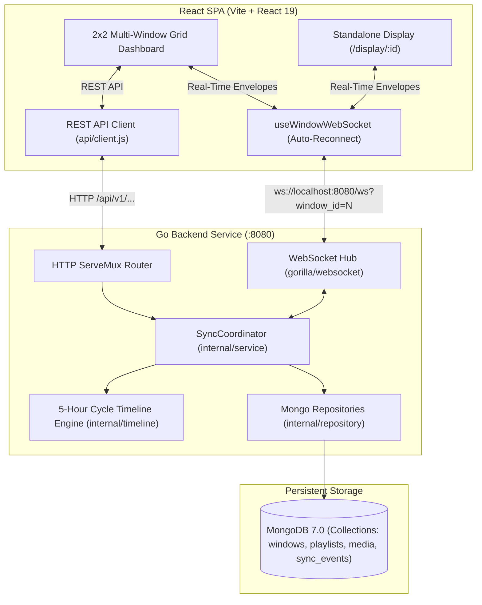

# EVA Bharat: Multi-Window Media Sequencer with Synchronized Playback

A production-grade, server-authoritative multi-window media sequencer and real-time playback synchronization system built for the **EVA Bharat Backend Development Intern Evaluation**.

---

## 1. System Overview

In digital signage and distributed multi-display installations, multiple independent windows play distinct looping sequences of video and image media continuously over a fixed **5-hour cycle**. When an operator triggers a **Synchronization Event** (e.g. displaying an emergency message, advertisement, or shared media `M2`), every window across all connected displays must switch to that media item simultaneously. Once the sync period ends, each window resumes its own normal playlist sequence without drift or losing stored playlist configurations.

```
┌───────────────────────────────────────────────────────────────────────────┐
│                       EVA Bharat Media Sequencer                          │
├─────────────────────────────────────┬─────────────────────────────────────┤
│ Window 1: Display Output 1          │ Window 2: Display Output 2          │
│ [ Normal Sequence: M1 -> M2 -> M3 ] │ [ Normal Sequence: M4 -> M5 ]       │
│                                     │                                     │
├─────────────────────────────────────┼─────────────────────────────────────┤
│ Window 3: Display Output 3          │ Window 4: Display Output 4          │
│ [ Normal Sequence: M6 -> M7 -> M8 ] │ [ Normal Sequence: M1 -> M4 ]       │
│                                     │                                     │
├─────────────────────────────────────┴─────────────────────────────────────┤
│ Console Deck: [⚡ Real-Time Sync Override] [📋 Playlist Manager]           │
└───────────────────────────────────────────────────────────────────────────┘
```

---

## 2. Architecture & Technology Stack



* **Backend**: Golang (Go 1.24) with Clean Architecture, standard library `net/http` routing, structured JSON logging (`log/slog`), and `gorilla/websocket`.
* **Database**: MongoDB 7.0 as the authoritative persistent source of truth (Windows, Playlists, Media Catalog, Sync Events).
* **Frontend**: React 19, Vite, Vanilla CSS with custom modern design system (responsive 2x2 grid, dark theme, audio unmute gestures).
* **Testing**: Go unit, integration, and concurrency tests (`go test`); Frontend tests (`vitest` + `@testing-library/react`); Chromium browser verification via automated browser agent.

---

## 3. Core Technical Capabilities

### A. 5-Hour Cycle Timeline Engine (`internal/timeline`)
* **Strict Specification Compliance**: Each window is mapped to a continuous repeating cycle duration of exactly **18,000 seconds (5 hours)** anchored to `CycleStartTime`.
* **Zero Artificial Blanks**: If a configured sequence is shorter than 5 hours (e.g. 60 seconds), it repeats continuously:
  $$\text{elapsed} = (T_{\text{query}} - T_{\text{cycle\_start}}) \pmod{18000\text{s}}$$
  $$\text{sequenceOffset} = \text{elapsed} \pmod{\text{totalSequenceDuration}}$$
* Blank frames are only displayed when an explicit blank item is deliberately configured in the playlist.

### B. Server-Authoritative Real-Time Synchronization
* **Predictive Lead Time**: Instead of sending a naive `"PLAY NOW"` command, the server generates UTC boundaries:
  $$\text{startTime} = T_{\text{now}} + 1000\text{ms} \quad (\text{leadTimeMs})$$
  $$\text{endTime} = \text{startTime} + \text{durationSeconds}$$
  Browsers have a 1-second preparation buffer to preload the asset and begin playback in lockstep.
* **Temporary Playback Override**: Sync is strictly an ephemeral override layer. Playlists stored in MongoDB are **never mutated, deleted, or truncated**.
* **Deterministic Wall-Clock Resumption**: When sync expires, windows calculate the exact item that *should* be playing right now on the 5-hour cycle, avoiding playlist drift.
* **Mid-Sync Joining & Offset**: When a new window connects mid-sync, it receives:
  $$\text{syncOffsetMs} = \max(0, T_{\text{estimatedServer}} - T_{\text{startTime}})$$
  Late joiners seek immediately to the elapsed second rather than starting from zero.
* **Crash Resilience & Startup Recovery**: If the backend restarts during an active sync, it inspects MongoDB on boot, re-arms the expiration timer for the remaining duration, and resumes active sync.

### C. Concurrency Safety & Gorilla WebSocket Architecture
* Gorilla WebSocket connections prohibit concurrent writes.
* Each client runs a dedicated `writePump` consuming from a buffered `chan []byte` (capacity 256), ensuring strict single-writer safety.
* Thread-safe WebSocket Hub manages window routing and stale connection cleanup via ping/pong heartbeats.

---

## 4. Quick Start Guide

### Option 1: Run with Docker Compose (Recommended)
Launch the complete stack (MongoDB + Go Backend + React Frontend + Nginx) with one command:
```bash
docker compose up --build
```
* **Frontend Application**: `http://localhost:5173`
* **Backend REST API**: `http://localhost:8080/api/v1/health`
* **WebSocket Endpoint**: `ws://localhost:8080/ws`

### Option 2: Run Locally (Development Mode)

#### 1. Start MongoDB
Ensure MongoDB is running locally on port `27017`:
```bash
# Default connection: mongodb://localhost:27017
```

#### 2. Start Go Backend
```bash
cd backend
go run ./cmd/server
```
The backend initializes indexes, seeds sample media assets and windows, and starts listening on `:8080`.

#### 3. Start React Frontend
```bash
cd frontend
npm install
npm run dev
```
Open `http://localhost:5173` in any modern browser.

---

## 5. API & WebSocket Specification

### REST Endpoints
| Method | Endpoint | Description |
| :--- | :--- | :--- |
| `GET` | `/api/v1/health` | Healthcheck and MongoDB ping status. |
| `GET` | `/api/v1/time` | Authoritative UTC server time for clock skew calculation. |
| `GET` | `/api/v1/windows` | List all display windows. |
| `GET` | `/api/v1/windows/:id` | Get window configuration. |
| `GET` | `/api/v1/media` | List media catalog assets. |
| `GET` | `/api/v1/windows/:id/playlist` | Get configured playlist for a window. |
| `POST` | `/api/v1/windows/:id/playlist` | Append media item to window playlist. |
| `DELETE` | `/api/v1/windows/:id/playlist/:itemId` | Remove item from window playlist. |
| `GET` | `/api/v1/windows/:id/playback` | Calculate current playback state from 5-hour engine. |
| `POST` | `/api/v1/sync` | Trigger global sync override (`media_id`, `duration_seconds`). |
| `GET` | `/api/v1/sync/current` | Get current active sync event. |
| `POST` | `/api/v1/sync/:id/cancel` | Cancel an active sync override immediately. |

### WebSocket Protocol (`ws://localhost:8080/ws?window_id=N`)
All messages adhere to a strongly typed envelope:
```json
{
  "type": "STATE_SNAPSHOT | PLAYLIST_UPDATED | SYNC_STARTED | SYNC_ENDED | ERROR",
  "version": 1,
  "timestamp": "2026-09-16T14:24:52.977Z",
  "payload": { ... }
}
```

---

## 6. Testing & Quality Assurance

### Run All Backend Tests (Go)
```bash
cd backend
go test -v -count=1 ./...
```
* **10/10 Go packages passing 100%**: Config, Database, Models, Repositories, Services, Timeline Engine, Utilities, WebSocket Hub, Handlers, and E2E WebSocket Integration tests.

### Run All Frontend Tests (Vitest)
```bash
cd frontend
npm test
```
* **15/15 unit tests passing**: Time synchronization, offset calculations, status badges, video/image/blank players.

### Frontend Production Build
```bash
cd frontend
npm run build
```
* Builds production-optimized bundle in under 300ms.

---

## 7. Key Discussion Topics for EVA Bharat Technical Round

1. **Why Server-Authoritative Timing Beats Client Timing**: Broadcasting "Play Now" fails due to packet arrival variance across devices. Providing a future UTC timestamp with a 1000ms lead time allows browsers to preload media and synchronize playback at the sub-second level.
2. **Why Wall-Clock Resumption Beats Pausing**: If sync paused playlist timers, a 10-minute sync would permanently skew all windows by 10 minutes from their broadcast schedule. Calculating resumption directly against wall-clock time preserves schedule fidelity.
3. **Gorilla WebSocket Single-Writer Guarantees**: Demonstrating how the Go backend's `writePump` channel pattern prevents connection corruption during concurrent broadcasts.
4. **Crash Recovery Architecture**: How `RecoverActiveSyncOnStartup` reconciles in-flight syncs with MongoDB on startup, ensuring that server restarts never leave displays in an inconsistent state.
